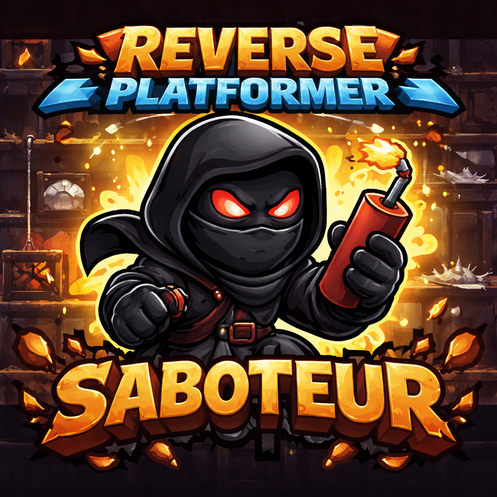

# Reverse Platformer - Saboteur

A browser-based game where you **control the level, not the character**. Place traps to stop an AI-controlled runner from reaching the goal.



> **Note:** This project was built as an experiment using [Claude](https://claude.ai) (Anthropic's AI assistant) and to explore **Hexagonal Architecture** (Ports & Adapters pattern) in a Java/Spring Boot context.

## Gameplay

- An AI runner automatically moves and jumps through the level
- You place traps to stop it before it reaches the goal
- Earn points over time to buy more traps
- 5 levels with increasing difficulty (faster runner, fewer starting points)

| Trap | Cost | Effect |
|------|------|--------|
| Spike | 50 | Instant kill |
| Bounce | 20 | Launches runner (can backfire!) |
| Slow | 15 | Reduces speed |

## Tech Stack

- **Backend:** Java 25, Spring Boot 4.0
- **Frontend:** HTML5 Canvas, JavaScript
- **Communication:** WebSocket (real-time game state)

## Architecture

This project follows **Hexagonal Architecture** (Ports & Adapters):

```
┌─────────────────────────────────────────────────────────────┐
│                      ADAPTERS (in)                          │
│              GameWebSocketAdapter (WebSocket)               │
└─────────────────────────┬───────────────────────────────────┘
                          │
┌─────────────────────────▼───────────────────────────────────┐
│                    PORTS (in)                               │
│         GameUseCase, LevelUseCase, TrapUseCase              │
└─────────────────────────┬───────────────────────────────────┘
                          │
┌─────────────────────────▼───────────────────────────────────┐
│                 APPLICATION SERVICES                        │
│          GameService, LevelService, TrapService             │
│                      GameSession                            │
└─────────────────────────┬───────────────────────────────────┘
                          │
┌─────────────────────────▼───────────────────────────────────┐
│                       DOMAIN                                │
│  Models: Runner, Platform, Trap, Level, GameState           │
│  Services: PhysicsService, RunnerAIService                  │
└─────────────────────────────────────────────────────────────┘
```

### Package Structure

```
io.hellorin.reverseplatformer/
├── domain/
│   ├── model/          # Entities & Value Objects (no dependencies)
│   └── service/        # Domain services (physics, AI)
├── application/
│   ├── ports/in/       # Input port interfaces (use cases)
│   └── service/        # Application services (one per use case)
└── adapters/
    └── in/websocket/   # WebSocket adapter (driving adapter)
```

### SOLID Principles Applied

- **SRP:** Each service has a single responsibility (GameService, LevelService, TrapService)
- **OCP:** New adapters can be added without modifying the core
- **LSP:** Services properly implement their interfaces
- **ISP:** Three focused interfaces instead of one fat interface
- **DIP:** Adapters depend on ports (abstractions), not implementations

## Running the Game

```bash
mvn spring-boot:run
```

Then open: **http://localhost:9000**

## How to Play

1. Click **START**
2. Select a trap (Spike / Bounce / Slow)
3. Click on the game canvas to place it
4. Stop the runner before it reaches the green goal!

## Built With Claude

This entire project - game design, architecture, implementation, and refactoring - was created through conversation with Claude (Anthropic's AI). It demonstrates:

- Iterative development through natural language
- Architectural discussions and trade-offs
- Refactoring to improve code quality
- Applying SOLID principles in practice

## License

MIT
